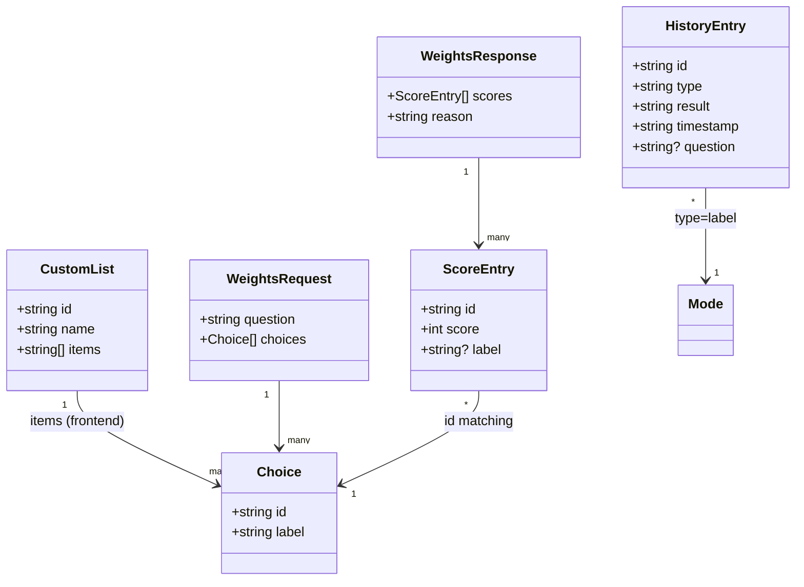

# Modelo de dominio / datos

Este documento describe las entidades actuales, sus relaciones y qué parte se persiste.

## Entidades principales

### `Mode`
Representa el modo activo de la app.

```ts
type BuiltInMode = "binary" | "binaryAI" | "dice";
type CustomListMode = string; // id de CustomList
type Mode = BuiltInMode | CustomListMode;
```

- **Persistencia**: no se persiste; se mantiene en memoria (`currentMode`).

### `CustomList`
Lista de opciones creada por el usuario.

```ts
type CustomList = {
  id: string;      // generado con Date.now().toString()
  name: string;    // nombre visible
  items: string[]; // opciones (1..n)
};
```

- **Persistencia**: array en `localStorage["customLists"]`.

### `HistoryEntry`
Registro de una decisión hecha por el usuario.

```ts
type HistoryEntry = {
  id: string;         // `${Date.now()}-${randHex}`
  type: string;       // etiqueta del modo (ver docs/modes.md)
  result: string;     // opción ganadora visible
  timestamp: string;  // ISO datetime
  question?: string;  // pregunta (solo IA o listas IA)
};
```

- **Persistencia**: array en `localStorage["decisionHistory"]` (orden cronológico descendente).

### `WeightsRequest`
Payload enviado al Worker para ponderaciones.

```ts
type Choice = { id: string; label: string };
type WeightsRequest = {
  question: string;   // 1..1000 chars
  choices: Choice[];  // 2..12 items, ids únicos
};
```

### `WeightsResponse`
Respuesta mínima requerida del Worker.

```ts
type ScoreEntry = { id: string; score: number; label?: string };
type WeightsResponse = {
  scores: ScoreEntry[]; // mismo tamaño e ids que choices
  reason: string;       // 1..300 chars
  meta?: { provider: string; model: string };
};
```

- **Persistencia**: no se persiste; se muestra en UI.
- El frontend añade `label` si falta.

## Relaciones



## Estado efímero relevante

```ts
type UiSessionState = {
  currentMode: Mode;
  listAiEnabled: boolean; // checkbox en modo lista
  spinning: boolean;      // solo decisiones manuales
  editingListId: string | null; // modal de listas
  lastWeights?: WeightsResponse;
  lastErrorCode?: string;
};
```

