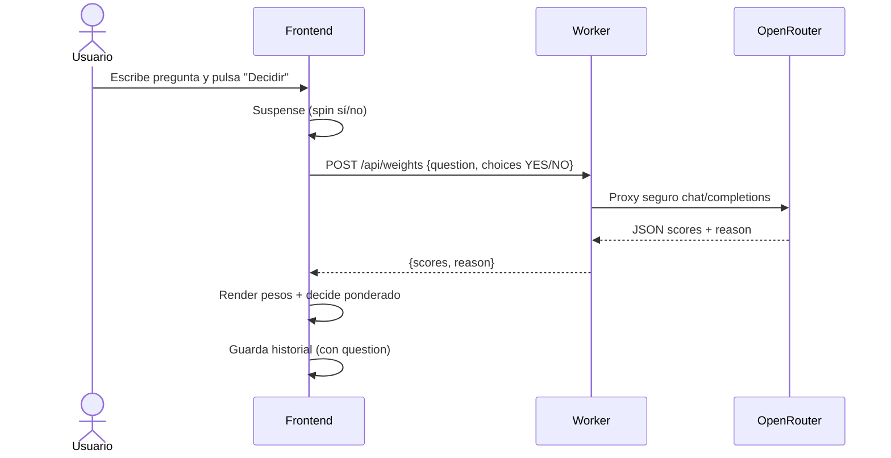

# Flujos de usuario

Los flows describen cómo interactúa un usuario y qué estados principales atraviesa la app.

## Selección de modo
1. Usuario abre menú (botón superior).
2. Elige un modo integrado o una lista.
3. UI actualiza chip de modo y controles relevantes (pregunta IA o toggle IA de lista).

## Decidir en modo Sí/No (IA OFF)
1. Usuario pulsa “Decidir”.
2. UI entra en suspense (animación alternando sí/no).
3. Tras ~2s, se fija resultado uniforme.
4. Se guarda en historial.

## Decidir en modo Sí/No (IA ON)

## Decidir en modo Dado
1. Usuario pulsa “Decidir”.
2. UI entra en suspense alternando 1..6.
3. Resultado uniforme.
4. Se guarda en historial.

## Decidir en lista (IA OFF)
1. Usuario selecciona lista desde menú.
2. Pulsa “Decidir”.
3. Suspense alternando opciones de la lista.
4. Resultado uniforme.
5. Se guarda en historial.

## Decidir en lista (IA ON)
1. Usuario selecciona lista.
2. Activa “Decidir listas con IA”.
3. Pulsa “Decidir”.
4. Suspense alternando opciones.
5. Frontend llama al Worker con `question=list.name` y `choices=ITEM_i`.
6. Renderiza pesos y decide ponderado.
7. Guarda historial con `question=list.name`.

## Gestión de listas
### Crear
1. “+ Nueva Lista”.
2. Completa nombre y opciones (una por línea).
3. Guardar → persiste en `customLists` y aparece en menú.

### Editar
1. En el menú de listas, pulsa “Editar”.
2. Cambia nombre/opciones.
3. Guardar → actualiza lista; si era el modo activo, actualiza chip.

### Eliminar
1. “Eliminar” en menú o modal.
2. Confirmación.
3. Borra de `customLists`. Si era modo activo, vuelve a `binary`.

## Historial
1. Abrir “Historial” desde menú.
2. Ver lista de decisiones.
3. “Borrar” elimina una entrada.
4. “Borrar historial” elimina todas las entradas.

## Actualizaciones PWA
1. El navegador detecta una nueva versión del Service Worker y la instala.
2. La nueva versión queda en estado **waiting** (no se activa automáticamente).
3. Usuario abre el menú y pulsa “Comprobar actualizaciones”.
4. Si hay nueva versión disponible, la UI ofrece “Actualizar ahora”.
5. Si el usuario acepta, el Service Worker activa (skipWaiting) y toma control.
6. Envía mensaje `SW_ACTIVATED`.
7. UI muestra toast y recarga una sola vez.

