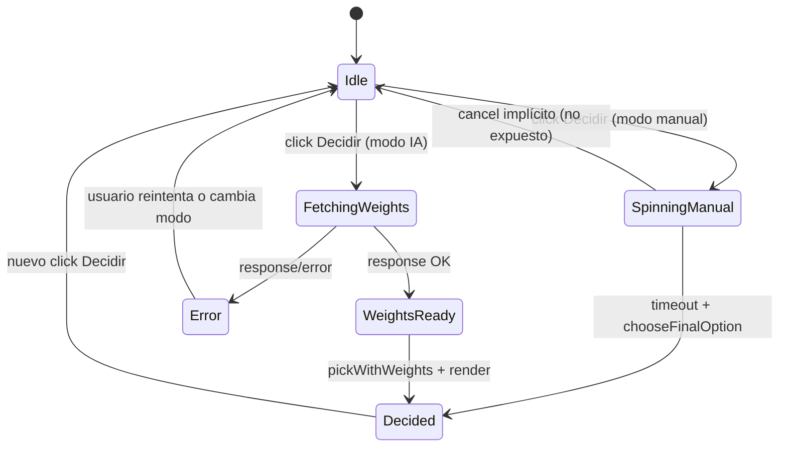
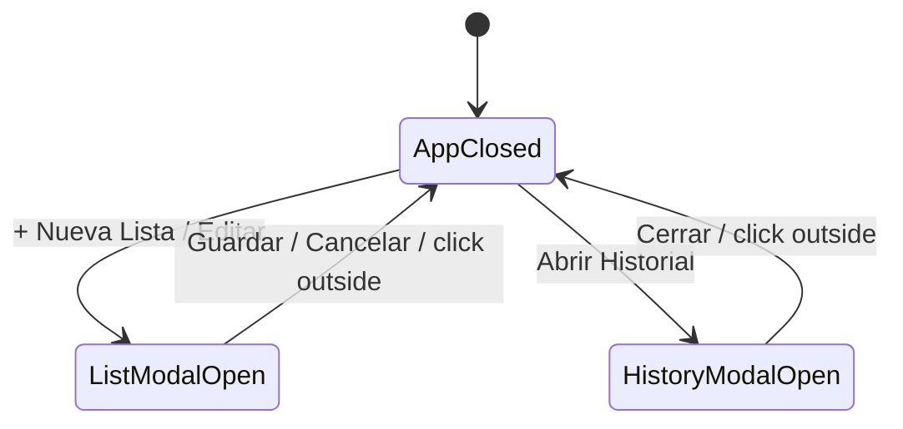

# Máquina de estados

Diagrama de alto nivel para la sesión de decisión.

Notas:
- En modos manuales (`binary`, `dice`, listas IA OFF) existe el flag `spinning` para evitar reentrancia.
- En modos IA el botón se deshabilita durante `FetchingWeights`; no se usa `spinning` pero el efecto es equivalente.
- El estado `WeightsReady` solo vive durante el render de pesos; los pesos no se persisten.

Estados de UI auxiliares (modales):

