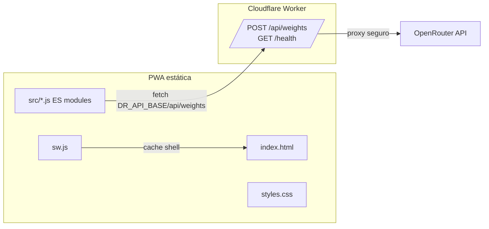

# Visión general del sistema

## Qué es
Decisiones Rápidas es una PWA estática para tomar decisiones simples:
- **Sí/No** (aleatorio 50/50).
- **Sí/No con IA** (ponderación vía backend).
- **Dado de 6 caras**.
- **Listas personalizadas** (con decisión uniforme o con IA opcional).

La app está pensada para desplegarse sin build step, como sitio estático en GitHub Pages, con un backend mínimo en Cloudflare Workers para acceder a OpenRouter de forma segura.

## Arquitectura

### Frontend
- **Sin framework/bundler**. Se usa `type="module"` y módulos ES en `src/`.
- **Entrypoint**: `src/app.js` inicializa UI y listeners.
- **Lógica de decisión**: `src/game.js`.
- **Integración IA**: `src/api.js` llama al Worker.
- **Persistencia local**: `src/storage.js` encapsula `localStorage`.
- **UI / DOM**: `src/ui.js`.
- **Utilidades**: `src/utils.js`.
- **Config**: `src/config.js` (API base y modos estáticos).
- **Service Worker**: `sw.js` cachea shell estático y notifica updates.

### Backend (Worker)
- Código en `worker/src/index.js`.
- Expone:
  - `POST /api/weights` para obtener ponderaciones.
  - `GET /health` para diagnóstico rápido.
- Aplica CORS con allowlist (`ALLOWED_ORIGINS`).
- Mantiene la API key solo en secrets de Cloudflare.

## Entornos
- **Producción**:
  - PWA en GitHub Pages.
  - Worker desplegado en Cloudflare.
- **Local**:
  - Worker con `wrangler dev` en `http://127.0.0.1:8787`.
  - PWA servida con `python -m http.server 8083`.
  - `window.DR_API_BASE` se autodetecta en `index.html` (prod vs local) y se normaliza en `src/config.js`.

## Estructura del repo (relevante)
- `index.html`, `styles.css`, `manifest.webmanifest`, `sw.js`: shell PWA.
- `src/`: frontend modular.
- `worker/`: Cloudflare Worker.
- `specs/`: specs Speckit (cambios).
- `docs/`: documentación viva canónica (este directorio).

## Deuda / notas actuales
- `sw.js` incluye `./app.js` en su lista de assets cacheados, pero el entrypoint real es `src/app.js`. No rompe la app, pero puede ser un ajuste futuro si se quiere cachear explícitamente el módulo principal.

